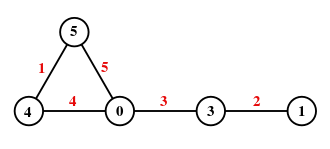

# graceful

A visualization library for the Tree of Graceful Trees (GTT).

## Mathematical Background

A [graceful labeling](https://en.wikipedia.org/wiki/Graceful_labeling) of a graph $G=(V,E)$ with $m$ edges is an injective assignment $f\colon V\to \{ 0,\ldots,m \}$ of integer labels to the vertices such that the induced map on edges $E\to \{ 1,\ldots,m \}$ labeling an edge as the absolute value of the differences between the vertex labels is a bijection.



A graph is called *graceful* if there exists a graceful labeling of that graph. The **Graceful Tree Conjecture** hypothesizes that every tree has a graceful labeling.

## This library

The purpose of this library is to provide a clean way 

## Tree

The `Tree` module provides an implementation of a rooted, labeled tree data structure. Unlike a binary tree,
each node in this tree can have an arbitrary number of children; also, every node in this tree has a label.

### Usage

To use the `Tree` module, first create a new tree using `Tree::new()`, which takes one argument: the label for the root node of the new tree. 
You can add new nodes to the tree using the `add_child()` method, specifying the value of the new child node. You can also use the `add_child_at_label()` method to add the new node as a child at an arbitrary point in the tree; node that if multiple nodes in the tree share the label, they will all have the new node added as a child.
You can retrieve all nodes in the tree using the `get_nodes()` method. 
You may also retrieve only the children of the root node by using the `root_children()` method.
The `leaves()` method returns a vector of all leaves in the tree.

The order of the tree (number of vertices) may be obtained with the `order()` method, and the depth (maximum distance of a leaf from the root node) with the `depth()` method.

A fancy display style for trees with indentation has been implemented as the `pretty_print()` method.


### Example

```rust
use tree::Tree;
// Create a new tree
let mut tree = Tree::new();
// Add nodes to the tree
let root = tree.add_node(None, "Root");
let child1 = tree.add_node(Some(root), "Child 1");
let child2 = tree.add_node(Some(root), "Child 2");
// Get the children of the root node
let children = tree.root_children(root);
assert_eq!(children.len(), 2);
assert_eq!(children[0].value, "Child 1");
assert_eq!(children[1].value, "Child 2");
// Print an ascii representation of the tree
tree.print();
// Print the tree with fancy indentation
tree.pretty_print();
```